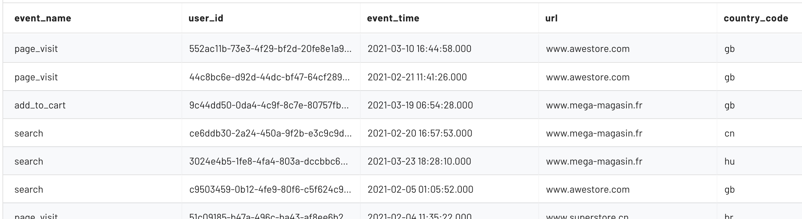
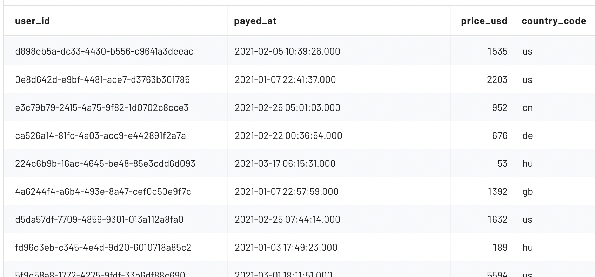

# Mitzu Core Concepts

## Mitzu Project

In the heart of Mitzu there is the Mitzu Project class. This holds everything together.
It contains the: 
-  connection information 
-  table references
-  discovery defaults
-  analytics defaults 
-  chart defaults

```python
import mitzu.model as M

M.Project(
    connection = ...
    event_data_tables = ...
    discovery_defaults = ...
    analytics_defaults = ...
    chart_defaults = ...
)
```

### Connection

The `Connection` class contains the relevant information for reaching the data warehouse or lake.

```python
import mitzu.model as M

M.Project(
    connection = M.Connection(
        connection_type = M.ConnectionType.TRINO,
        host = "host",
        port = 443,
        user_name = "user_name",
        secret_resolver = ...
        catalog = "catalog",
        schema = "schema",
        extra_configs = {}        
    )
    event_data_tables = ...
    discovery_defaults = ...
    analytics_defaults = ...
    chart_defaults = ...
)
```

--- 

In the `Connection` class you need to provide the `connection_type`. Mitzu supports these connections types at the moment:

- ATHENA
- DATABRICKS
- FILE
- MYSQL
- POSTGRESQL
- SNOWFLAKE
- SQLITE
- TRINO

Mitzu establishes the connection to the data warehouse or lake with [SQL Alchemy](https://www.sqlalchemy.org/).

### Secret Resolvers

To avoid hardcoding secrets to code Mitzu provides the `SecretResolver` classes.
There are 3 `SecretResolver` types:

```python
import mitzu.model as M

# Reading secrets from environmental variables
M.EnvVarSecretResolver(variable_name='env_var_name') 

# Prompting the user for Secrets
M.PromptSecretResolver(title='password')

# Hardcoding secrets to the project. For testing, avoid using in production
M.ConstSecretResolver(secret='secret')
```

Usage:

```python
import mitzu.model as M

M.Project(
    connection = M.Connection(            
        secret_resolver = M.EnvVarSecretResolver(variable_name='DWH_SECRET')
        ...    
    )
    ...
)
```

Mitzu gets and caches the secret from the `SecretResolver` at the first query execution.

More secret resolvers are coming soon. The aim is to integrate with most cloud provider credential storages. 

### Event Data Tables

The `EventDataTable` class is the reference to a single table in the data warehouse or data lake. 

> The referenced tables must contain user event logs. These are records that describe a user action. (e.g `payment`, `sign up`, `page visit`, `search`, `app opened`, etc.)
> These tables must contain the `user identifier` and a `timestamp` when the event happened.
> <br/><br/> **Example (`web_events` multi event table):** 
> 
> <br/><br/> **Note:** The `event_name` is not a mandatory column. If the `event_name` column is missing the table contains a single event type. In this case the table name is referring to the name of event. 
> <br/><br/> **Example (`payments` single event table):**
> 

Mitzu simultaneously queries one or more event data tables in the data warehouse or data lake.


```python
import mitzu.model as M

t1 = M.EventDataTable.single_event_table(
    table_name = 'payments',  
    user_id_field = 'user_id', # the column name of the user reference
    event_time_field = 'payed_at', # the column name for the time of the payment
    event_name_alias = 'user_payment', # the alias for the event
    ignore_fields = ['_hash'] # list of columns to ignore
    date_partition_field = 'date' # More on this later
)

t2 = M.EventDataTable.multi_event_table(
    table_name = 'web_events', 
    user_id_field = 'user_id',
    event_time_field = 'event_time', # the column name for the time of the event
    event_name_field = 'event_name', # the column for the name of the event
    ignore_fields = ['_hash'] # list of columns to ignore
    event_specific_fields = ['url'] # More on this later
    date_partition_field = 'date' # More on this later
)

M.Project(
    ...
    event_data_tables = [t1, t2]
)
```

Special event data table properties:

- `event_specific_fields`: This column names listed in this property will be discovered per event. More about event data table discovery at the discovery section.
- `date_partition_field`: This property makes sense for `data lakes` if the data is partition by `date` of the event time.

### Supported Column Types

Mitzu doesn't require any column to be of a specific type. For best performance the recommended types are:

- `event type column` - STRING
- `event time column` - TIMESTAMP (try to avoid DATE type as it will result in invalid product analytics metrics)
- `user id column` - STRING
- `date partition column` - DATE (if using a date lake with partitioned tables)

#### Complex Types

Some data warehouse or data lakes support complex types such as MAPs and STRUCTs. 
Mitzu supports both of these as long as they contain only simple types. 

Examples:
- `MAP<string, string>` - SUPPORTED
- `MAP<int, int>` - SUPPORTED
- `MAP<string, MAP<string, string>>` - NOT SUPPORTED
- `STRUCT<col_name: MAP<string, string>>` - NOT SUPPORTED
- `STRUCT<col_name1: string, col_name2: int>` - SUPPORTED

### Project Defaults

> To Be Done...

## Event Data Discovery

The event data discovery is the process where Mitzu discovers the possible values for every column in every event data table. Mitzu uses these values to populate the `webapp` dropdowns or the `notebook class model` for autocompletion.

Start the discovery process with:
```python
import mitzu.model as M

project = M.Project( ... )

# Discovering the project
dp = project.discover_project()

# Persisting the discovered project
dp.save_to_project_file('project_name')

# Loading persisted projects
dp = M.DiscoveredProject.load_from_file('project_name')
```

The discovery process can last a significant amount of time depending on the 
date lake or warehouse performance or by the size of the event data tables.
Discovering the project and persisting it enables the users of Mitzu to start product analytics without the initial wait.

# Product Analytics

## Segmentation

> To Be Done...
 
## Funnels

> To Be Done...

## Retention

> To Be Done...

## Journeys

> To Be Done...

## Revenue

> To Be Done...

## Cohorts

> To Be Done...

## Product Analytics With Notebook Class Model

The discovered project itself is not yet usable. We need either to load it to the webapp or to the notebook as a `class model`.

The class model is a handy way to query the data. 
You can find how to use the notebook class model in the [README](README.md)

## Product Analytics In The Webapp

## Revenue

> To Be Done...


# Web APP

> Coming Soon