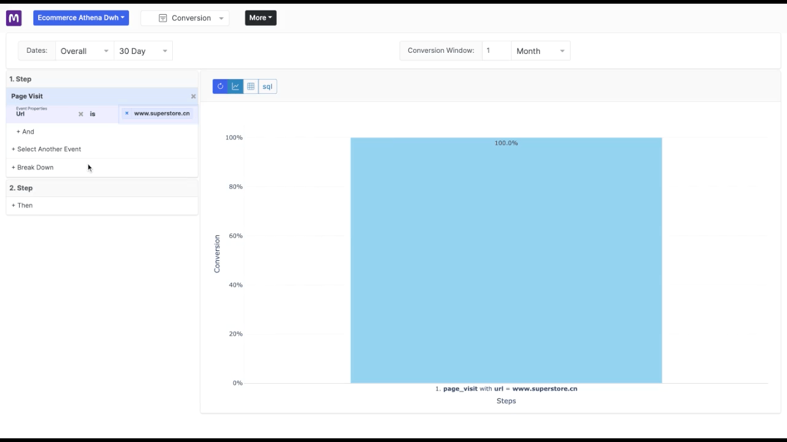
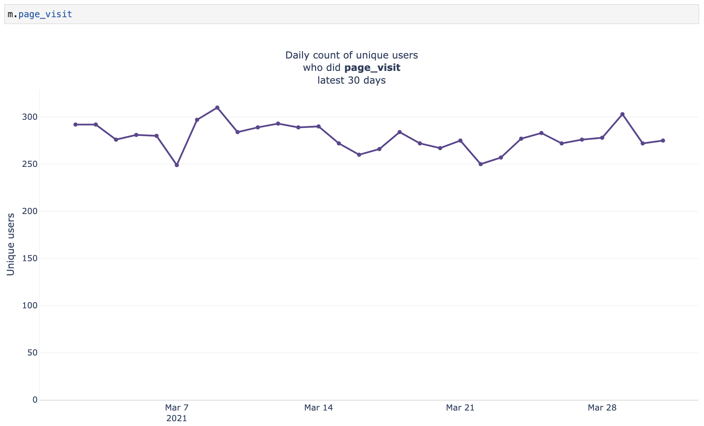

[](https://badge.fury.io/py/mitzu)

[](https://pypi.org/project/mitzu/)


<h2 align="center">
<b>Mitzu<b> is an open source <b>product analytics </b> tool that queries your <b>data lake</b> or <b>data warehouse</b>.
</h2>
</br>



</br>

# Features
-  Visualization for:
   - Funnels 
   - Segmentation
   - Retention (coming soon)
   - User Journey (coming soon)
   - Revenue calculations (coming soon)
- User Lookup (coming soon)
- Cohorts Analysis
- Standalone web app for non-tech people
- Notebook visual app
- Notebook low-code analytics in python
- Batch ETL jobs support

# Supported Integrations
Mitzu integrates with most modern data lake and warehouse solutions:

- Databricks Spark (SQL)
- Trino 
- AWS Athena
- Postgre
- MySQL
- Pandas Dataframes / SQLite

## Coming Soon
- Snowflake
- Clickhouse
- BigQuery
- Redshift

# Quick Start


In this section we will describe how to start with `Mitzu` on your local machine. Skip this section if you rather see `Mitzu` in a prepared notebook or webapp. Otherwise get ready and fire up your own data-science [notebook](https://jupyter.org/). 


----

Install Mitzu python library

```
pip install mitzu
```

The simplest way to get started with `Mitzu` is in a data-science notebook. In your notebook read the sample user behavior dataset.

```
import mitzu.samples as smp

dp = smp.get_simple_discovered_project()
m = dp.create_notebook_class_model()
```

The following command visualizes the `count of unique users` over time who did `page visit` action in the last `30 days`.

```
m.page_visit
```



In the example above `m.page_visit` refers to a `user event segment` for which the notebook representation is a `segmentation chart`. 
If this sounds unfamiliar, don't worry! Later we will explain you everything.


You can create a `funnel chart` by placing the `>>` operator between two `user event segments`.

```
m.page_visit >> m.purchase
```

This will visualize the `conversion rate` of users that first did `page_visit` action and then did `purchase` within a day in the last 30 days.

You can apply filters to `user event segment`

```
m.page_visit.country_code.is_us >> m.purchase
```

With this syntax we have narrowed down our `page visit` `user event segment` to page visits from the `US`.

## Usage In Notebooks

- [Example notebook](https://deepnote.com/mitzu-example) 
- [Notebook documentation](https://mitzu.io/documentation/notebook)

## Webapp

Mitzu can run as a standalone webapp or embedded inside a notebook.

- [Example webapp](https://app.mitzu.io)
- [Example notebook embedded webapp](https://deepnote.com/mitzu-example-webapp)
- [Webapp documentation](https://mitzu.io/webapp)

## Connect Your Own Data

Mitzu is be able to connect to your data warehouse or data lake.
To get started with your own data integration please read our handy [documentation](https://mitzu.io/documentation/integrate).