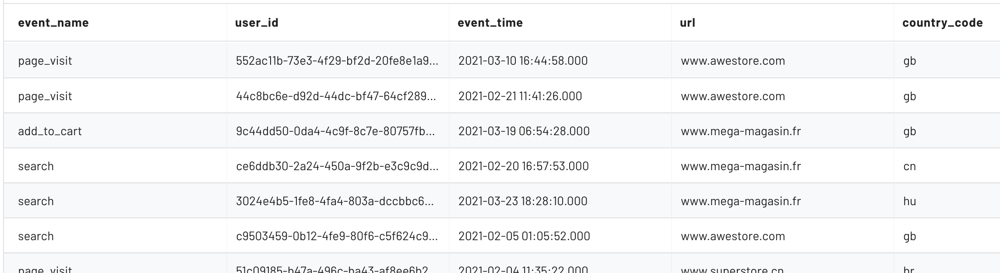

Project
=======

Configure a Project
-------------------

.. autoclass:: mitzu.model.Project
   :members:

Event Data Table
----------------

The :class:`EventDataTable <mitzu.model.EventDataTable>` class is the reference to a single table in the data warehouse or data lake.

.. autoclass:: mitzu.model.EventDataTable
   :members:


The referenced tables must contain user event logs. These are records that describe a user action. (e.g ``payment``, ``sign up``, ``page visit``, ``search``, ``app opened``, etc.)

These tables must contain the ``user identifier`` and a ``timestamp`` when the event happened.


**Example (web_events multi event table):**



**Note:** The ``event_name`` is not a mandatory column. If the ``event_name`` column is missing the table contains a single event type. In this case the table name is referring to the name of event.

**Example (payments single event table):**

  .. image:: ../resources/event_data_table_2.png
   :alt: event data table

Mitzu simultaneously queries one or more event data tables in the data warehouse or data lake.

.. code-block:: python

    import mitzu.model as M

    t1 = M.EventDataTable.single_event_table(
        table_name = 'payments',
        user_id_field = 'user_id', # the column name of the user reference
        event_time_field = 'payed_at', # the column name for the time of the payment
        event_name_alias = 'user_payment', # the alias for the event
        ignore_fields = ['_hash'] # list of columns to ignore
        date_partition_field = 'date' # More on this later
    )

    t2 = M.EventDataTable.multi_event_table(
        table_name = 'web_events',
        user_id_field = 'user_id',
        event_time_field = 'event_time', # the column name for the time of the event
        event_name_field = 'event_name', # the column for the name of the event
        ignore_fields = ['_hash'] # list of columns to ignore
        event_specific_fields = ['url'] # More on this later
        date_partition_field = 'date' # More on this later
    )

    M.Project(
        ...
        event_data_tables = [t1, t2]
    )

Special event data table properties:

- ``event_specific_fields``: This column names listed in this property will be discovered per event. More about event data table discovery at the discovery section.
- ``date_partition_field```: This property makes sense for `data lakes` if the data is partition by `date` of the event time.


Discovery Settings
------------------

.. autoclass:: mitzu.model.DiscoverySettings


Webapp Settings
---------------

.. autoclass:: mitzu.model.WebappSettings